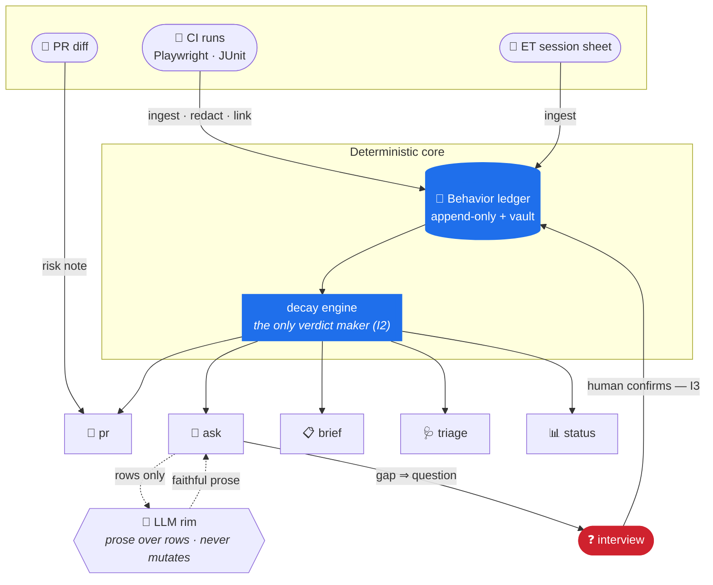

<div align="center">

# Cartographer

**A QA-AI map and behavior ledger that answers with evidence**

[](https://github.com/MiltonKlun/Cartographer/actions/workflows/ci.yml)


-brightgreen)


</div>

> _Cartography_: you don't re-survey the whole territory for every trip — you
> keep a **map**, and update the parts that changed. Cartographer keeps a living
> map of what your product promises and whether the evidence still backs it.

Most QA-AI tools generate artifacts **per story** and forget them. Cartographer
keeps a durable **behavior ledger** and answers a QA engineer's real interrupts
against it — _"is this PR safe?"_, _"why is CI red?"_, _"do we test X?"_, _"can
we ship?"_ — with **evidence-cited verdicts** that grow stale on their own when
the evidence ages.

> **Deterministic core, probabilistic rim.** The core computes every verdict and
> citation. The LLM only translates and proposes — it **never** mutates the
> ledger, and a prose answer that contradicts the rows is discarded.

---

## ❓ Why it exists

Ask an AI "do we test coupon stacking?" and you get a confident guess. Ask
Cartographer and you get a cited answer — or an honest `UNKNOWN` — backed by a
ledger you can audit.

| | You gain | What it means |
| --- | --- | --- |
| 🧾 | **Evidence or silence** | Every claim cites the behavior + evidence rows it rests on. No citation ⇒ the answer is refused, not fudged (invariant I1). |
| ⏳ | **Honest decay** | A verdict isn't a boolean — freshness decays over time and code churn, so a test that passed three months ago reads `STALE`, not `VERIFIED`. |
| 🙋 | **Meaning is human** | The AI drafts proposals; a human confirms them in an interview. An unconfirmed guess never counts as a fact (I3). |
| 🛡️ | **Guardrails that hold** | The selector-healer can fix a broken locator, but can **never** delete a test, add `.skip`, or weaken an assertion (I5). Your suite only strengthens. |

The payoff is a map that's **trustworthy under review**: it tells you what it
knows, how fresh that knowledge is, and refuses to pretend when it doesn't know.
Not every situation needs it — one-off scripts and no-regression work are better
served by prompting directly ([`docs/adoption.md`](docs/adoption.md) is honest
about the misfit cases).

---

## 🚦 Verdict states — the whole model in one glance

Every behavior carries exactly one verdict, computed by the decay engine (the
only place verdicts are made):

| State | Meaning |
| --- | --- |
| 🟢 `VERIFIED` | Fresh supporting evidence — trust it. |
| 🟡 `STALE` | Evidence exists but has decayed past the freshness threshold. |
| ⚪ `ASSERTED` | Confirmed as intended by a human, but not yet evidenced by a run. |
| ⚫ `UNKNOWN` | Not covered, or evidence decayed to nothing — the map won't pretend. |
| 🔴 `FAILING` | The newest evidence shows it broken (beats freshness — a fail always leads). |

```
F = exp(−Δt / τ_time(criticality)) × exp(−churn / τ_churn) × W(link_confidence)
```

Freshness `F` drops with elapsed time (faster for higher-criticality behaviors),
with code churn in the area, and with weaker evidence links. Thresholds turn `F`
into the state above.

---

## ⚙️ How it works

Evidence flows **in** from CI and exploratory sessions; questions flow **out** to
a human; the ledger sits in the middle and every read surface renders from it.



> 🔵 = deterministic core (computes every verdict) · 🔴 = the human is the only
> one who turns a proposal into a fact.

---

## 🚪 Quickstart — clone → first answer in ~5 min

**Node 22.13+ required.** Zero runtime dependencies beyond AJV.

```bash
npm install
npm run build
node bin/cart.mjs doctor        # check the environment first
```

```text
cart doctor — environment readiness
  ✓ node: v22.19.0 (≥ 22.13)
  ✓ node:sqlite: available
  ✓ git: git version 2.51.0
  ✓ vault: writable (./vault)
  ✓ heal: no interrupted heal
  ✓ config: decay.json + redaction.json valid
READY — you can `cart init` and start.
```

Cold-start a map from any repo with a test suite (below uses the bundled
`testdata/real` sample from the `got` library), then ask it something:

```bash
node bin/cart.mjs init                                  # create ledger.db
node bin/cart.mjs bootstrap import <repo> --apply --actor you
#   → scanned 2 test file(s) → 55 behavior proposal(s) (all unconfirmed)
node bin/cart.mjs interview --live --as you             # confirm/edit/merge — one keystroke each
node bin/cart.mjs ask "do we cache responses?"
```

> Until a proposal is confirmed, `ask` answers `UNKNOWN` and badges the matches
> as unconfirmed — a cold map does not pretend (I3). Wire
> `cart ingest playwright <report.json>` into CI and confirmed behaviors become
> `VERIFIED` with real freshness. Add `--prose` (needs `ANTHROPIC_API_KEY`) for
> an LLM summary over the cited rows.

---

## 📟 The surfaces

Seven read/act surfaces, all rendering from the same ledger:

| Command | What it answers / does |
| --- | --- |
| `cart ask "<q>" [--prose]` | The 30-second, evidence-cited answer. `--queue` files a gap as a question. |
| `cart pr <ref> [--repo D \| --diff F]` | Risk note for a diff: which behaviors it touches, ranked by criticality × staleness. |
| `cart brief` | One-screen morning brief — overnight verdict transitions, decayed-red, expiries. |
| `cart triage <report>` | Cluster a red CI run by failure signature; product / brittleness / env. |
| `cart status [--sla H]` | Ingestion health, record counts, verdict histogram (loud degradation — I6). |
| `cart session start\|note\|stop` | Silent ride-along exploratory sessions; the stop sheet becomes evidence (I8). |
| `cart heal <file> …` | Guardrailed selector heal: apply → re-run → green evidence, else auto-revert (I12). |

<details>
<summary><b>Full command list</b> (ingest, interview, bootstrap, guardrails, eval, …)</summary>

| Command | What it does |
| --- | --- |
| `cart doctor` / `cart init` | Environment check / create the ledger |
| `cart bootstrap import <repo> [--apply]` | Draft one unconfirmed behavior per discovered test |
| `cart interview --live --as <you>` | Confirm proposals one keystroke each (y/e/m/d/s/q) |
| `cart interview --batch N` / `--apply <json>` | List pending proposals / apply a batch of decisions |
| `cart ingest playwright\|junit\|session <file>` | CI results / ET sheets → evidence (redacted, linked, deduped) |
| `cart behavior add\|confirm\|list` | Manage behaviors directly |
| `cart verdict <BHV-id>` | Compute + render one decayed verdict |
| `cart quarantine add\|remove\|list` | Non-blocking flake lane (receipted, never edits test source) |
| `cart guardrails-check <orig> <patched>` | The §10 patch-safety gate (exit 1 on violation) |
| `cart eval [--golden <set>]` | Run the eval harness; exit 1 on any failure (CI-friendly) |
| `cart decline "<request>"` | Recommend raw prompting for one-off / no-regression work (I9) |
| `cart export [--no-receipt]` | Deterministic JSONL snapshot of the whole ledger |
| `cart vault gc [--apply]` | List / delete orphan evidence blobs (receipted) |

</details>

---

## 🛡️ The invariants (why you can trust the answers)

Cartographer is built around **12 invariants** enforced at code chokepoints
(claims renderer, autonomy gateway, decay engine, guardrails, redaction) — not
by convention. A few that shape everyday behavior:

| | Invariant | Guarantee |
| --- | --- | --- |
| **I1** | Evidence or silence | A claim with no citation is refused, never rendered. |
| **I2** | Decay is load-bearing | Verdicts carry state + freshness + provenance; the decay engine is the sole constructor (now a type-checked brand). |
| **I3** | Meaning is human | Unconfirmed proposals never count as facts; the interview is the approval. |
| **I5** | The NEVER list | No deleting tests, no `.skip`, no weakening assertions — not by any flag or agent. |
| **I6** | Loud degradation | Stale ingestion raises a banner on every surface. |
| **I7** | No per-person metrics | The map serves the engineer, never surveillance. |
| **I11** | Append-only & inspectable | Nothing is deleted (retire, don't remove); the whole ledger exports to diffable JSONL. |
| **I12** | Heals self-evidence | A selector heal isn't done until a green re-run proves it — else it auto-reverts. |

Full text in [`CONSTITUTION.md`](CONSTITUTION.md).

---

## 🧱 Tech stack

| Layer | Pieces |
| --- | --- |
| 🧩 **Runtime** | Node 22+ · TypeScript (strict) · `node:sqlite` (embedded, no native build) · GitHub Actions CI |
| 🔒 **Discipline** | JSON Schemas + AJV · append-only ledger w/ SQL triggers · content-addressed evidence vault · zero-dep custom lint |
| 🧠 **Core** | claims renderer · autonomy gateway · decay engine · guardrails · redaction — invariants enforced at each |
| 🤖 **Rim** _(optional)_ | Anthropic Messages API via built-in `fetch` (no SDK); rows-only in, faithful prose out, or silence |
| 📦 **Dependencies** | **one** runtime dependency (`ajv`); everything else is stop-and-ask |

---

## 🗂️ Repository layout

| Path | Contents |
| --- | --- |
| `src` | The core + surfaces (`ask`, `pr`, `brief`, `triage`, `heal`, decay, ledger, …) |
| `schemas` | JSON Schema contracts for every record (AJV-validated in CI) |
| `skills/cartographer` | The operating layer — how the assistant behaves on top of the built system |
| `config` | `decay.json` (freshness constants) · `redaction.json` · `health.json` |
| `docs` | Adoption, operations, testing guides · per-phase demos · decision records |
| `testdata` | Real-repo fixtures (`got`) + captured reports for offline, deterministic tests |
| `bin` | `cart.mjs` — the CLI entry point |

---

## 📐 Key design choices

- **One durable map, not per-story artifacts** — the ledger is the product; the
  surfaces are just views over it.
- **Decay over booleans** — freshness is load-bearing, so the map ages
  gracefully instead of lying with confidence.
- **The core enforces; the LLM requests** — a prose answer that drops or
  contradicts a cited row is thrown away. The rows are always the source of truth.
- **Cold start is first-class** — bootstrap import + a one-keystroke interview,
  and a minimum-viable-map rule so an empty map says `UNKNOWN` instead of guessing.
- **Out of scope by design** — no web dashboard, no embeddings, no ORM, no
  per-person metrics, no autonomous confirmation. Scaling waits for real data
  (see the decision records in [`docs/decisions/`](docs/decisions)).

---

## 📚 Documentation

- **[CONSTITUTION.md](CONSTITUTION.md)** — the 12 invariants, vocabulary, and anti-goals (read first).
- **[SPEC.md](SPEC.md)** — architecture, data model, decay formula, the 7 surfaces, autonomy matrix.
- **[docs/adoption.md](docs/adoption.md)** — honest fit / don't-fit guide.
- **[docs/operations.md](docs/operations.md)** — backup, restore, health SLA, redaction review.
- **[docs/testing.md](docs/testing.md)** — the unit / integration / e2e tiers and the "no vacuous pass" rule.
- **[skills/cartographer/SKILL.md](skills/cartographer/SKILL.md)** — the runtime operating layer.

---

## 📝 License

This project is licensed under the [MIT License](LICENSE). The `testdata/real/`
fixtures are unmodified test files vendored from the MIT-licensed
[sindresorhus/got](https://github.com/sindresorhus/got) — attribution in
[`testdata/real/README.md`](testdata/real/README.md).

---

## Author

**Milton Klun**  
*QA Automation Engineer | AI Quality Testing*

<div align="left">
  <a href="https://www.linkedin.com/in/milton-klun/"></a><a href="mailto:miltonericklun@gmail.com"></a><a href="https://www.miltonklun.com"></a>
</div>
